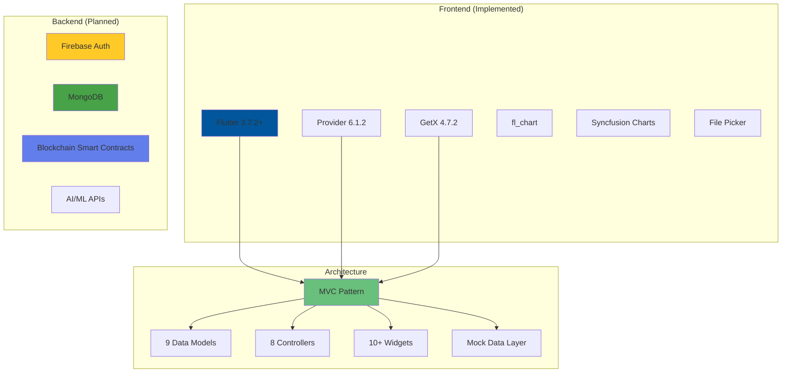

<div align="center">

# 🏆 FideFund - Blockchain Charity Platform

### VHack 2025 Top 10 Finalist | Flutter Prototype

[](https://flutter.dev)
[](https://dart.dev)

**Trust in Giving, Joy in Impact**

*Cross-platform mobile prototype demonstrating blockchain-powered charitable giving with milestone-based transparency.*

</div>

---

## 🎯 Overview

High-fidelity **Flutter prototype** for blockchain charity donations. **Frontend-only** with complete donor & charity workflows, sophisticated UI/UX, and production-ready architecture.

> **VHack 2025 Top 10 Finalist** • 15+ Screens • Custom Design System

---

## ✨ Features

**🔐 Blockchain Transparency** - Crypto/MYR payments • Transaction tracking • Milestone releases  
**📊 Real-Time Analytics** - Live progress charts • Interactive visualizations  
**🎮 Gamification** - Animated leaderboard • Contributor rankings  
**🎯 Dual Portals** - Donors: Browse, donate, track • Charities: Create, manage, report

---

## 🛠️ Tech Stack & Architecture



**Design System:** `#96C9DE` Primary • OpenSans fonts • 12px rounded corners • Card shadows  
**Demo:** 10 campaigns across 8 charity categories (Animal Welfare, Education, Disaster Relief, etc.)

---

## 🚀 Quick Start

```bash
git clone https://github.com/yourusername/Vhack-2025-FideFund.git
cd Vhack-2025-FideFund/frontend
flutter pub get
flutter run
```

---

## 💡 Skills Demonstrated

**Mobile:** Cross-platform Flutter • Animations (`AnimationController`, `Timer`) • Responsive UI  
**Engineering:** MVC architecture • Component design • Mock data layer  
**UI/UX:** Dual persona design • Gamification • Micro-interactions  
**System:** API-ready architecture • State management • Backend planning

---

## 📄 License

MIT License - see [LICENSE](LICENSE) file for details

---

## 👤 Author

**[Your Name]** - VHack 2025 Top 10 Finalist  
💼 [LinkedIn](https://linkedin.com/in/yourprofile) • 🐙 [GitHub](https://github.com/yourusername) • 📧 [Email](mailto:your.email@example.com)

---

<div align="center">

**Built with ❤️ using Flutter**

</div>
